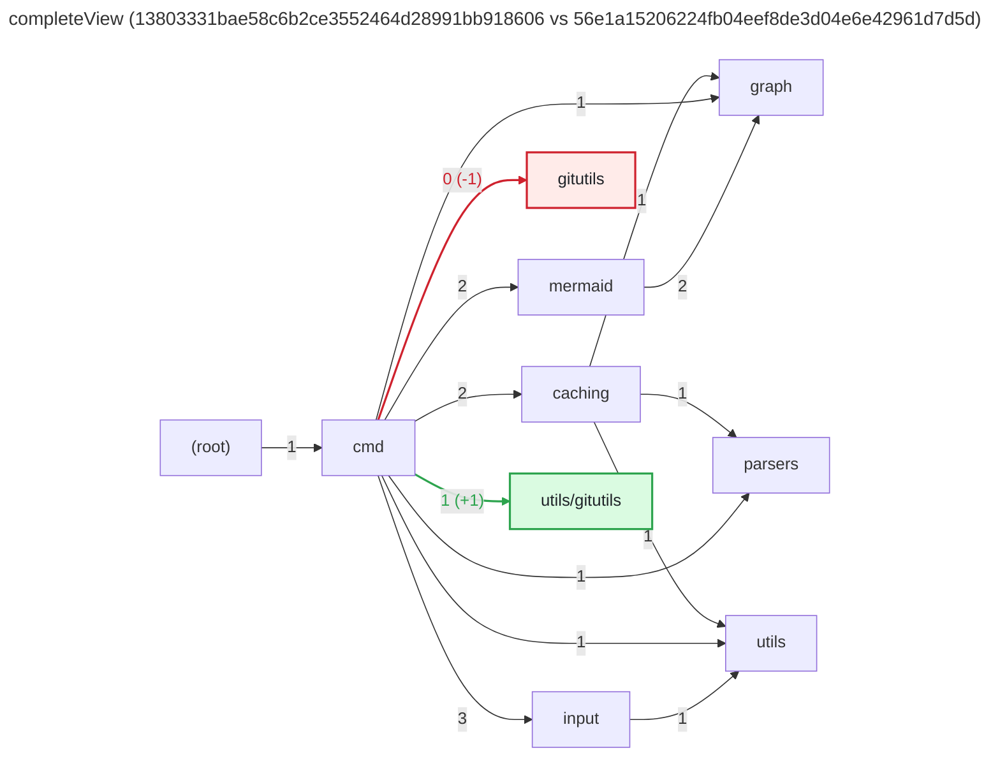

```mermaid
---
title: completeView (13803331bae58c6b2ce3552464d28991bb918606 vs 56e1a15206224fb04eef8de3d04e6e42961d7d5d)
config:
    theme: default
    maxTextSize: 50000
    maxEdges: 500
    fontSize: 16
---
flowchart LR
    0@{ shape: rect, label: "(root)"}
    1@{ shape: rect, label: "caching"}
    2@{ shape: rect, label: "cmd"}
    3@{ shape: rect, label: "gitutils"}
    style 3 color:#1f2328,fill:#ffebe9,stroke:#cf222e,stroke-width:2,stroke-dasharray:0
    4@{ shape: rect, label: "graph"}
    5@{ shape: rect, label: "input"}
    6@{ shape: rect, label: "mermaid"}
    7@{ shape: rect, label: "parsers"}
    8@{ shape: rect, label: "utils"}
    9@{ shape: rect, label: "utils/gitutils"}
    style 9 color:#1f2328,fill:#dafbe1,stroke:#2da44e,stroke-width:2,stroke-dasharray:0
    0 -->|"1"| 2
    1 -->|"1"| 4
    1 -->|"1"| 7
    1 -->|"1"| 8
    2 -->|"2"| 1
    2 -->|"0 (-1)"| 3
    2 -->|"1"| 4
    2 -->|"3"| 5
    2 -->|"2"| 6
    2 -->|"1"| 7
    2 -->|"1"| 8
    2 -->|"1 (+1)"| 9
    5 -->|"1"| 8
    6 -->|"2"| 4
    linkStyle 5 stroke:#cf222e,stroke-width:2px,color:#cf222e
    linkStyle 11 stroke:#2da44e,stroke-width:2px,color:#2da44e
```